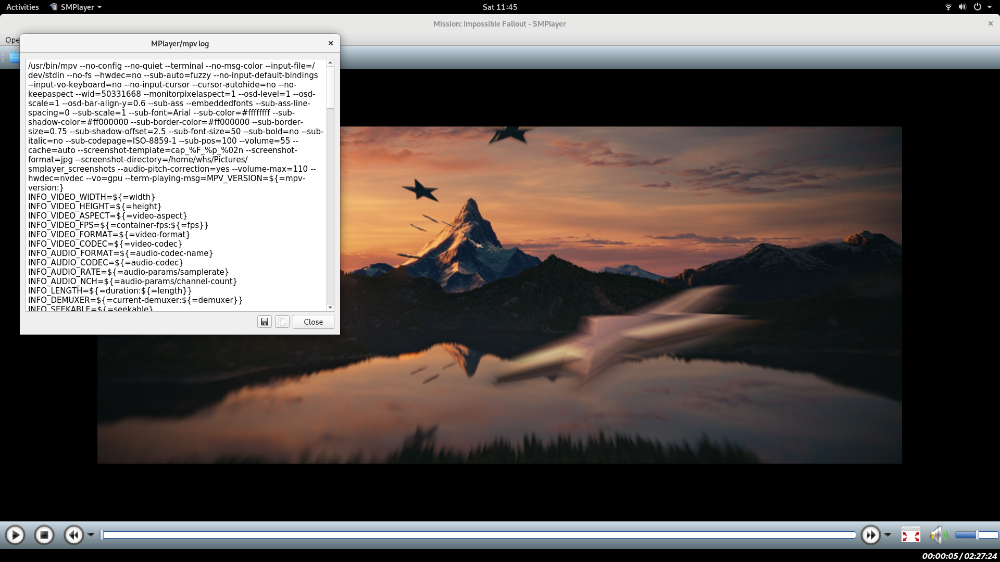
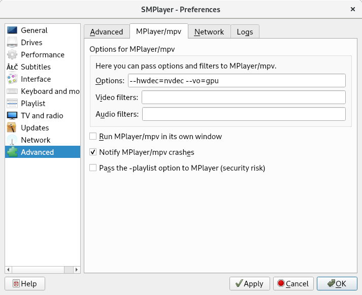

# Fedora 29 HTPC Setup Guide



## mpv log
```
/usr/bin/mpv --no-config --no-quiet --terminal --no-msg-color --input-file=/dev/stdin --no-fs --hwdec=no --sub-auto=fuzzy --no-input-default-bindings --input-vo-keyboard=no --no-input-cursor --cursor-autohide=no --no-keepaspect --wid=50331668 --monitorpixelaspect=1 --osd-level=1 --osd-scale=1 --osd-bar-align-y=0.6 --sub-ass --embeddedfonts --sub-ass-line-spacing=0 --sub-scale=1 --sub-font=Arial --sub-color=#ffffffff --sub-shadow-color=#ff000000 --sub-border-color=#ff000000 --sub-border-size=0.75 --sub-shadow-offset=2.5 --sub-font-size=50 --sub-bold=no --sub-italic=no --sub-codepage=ISO-8859-1 --sub-pos=100 --volume=55 --cache=auto --screenshot-template=cap_%F_%p_%02n --screenshot-format=jpg --screenshot-directory=/home/whs/Pictures/smplayer_screenshots --audio-pitch-correction=yes --volume-max=110 --hwdec=nvdec --vo=gpu --term-playing-msg=MPV_VERSION=${=mpv-version:}
INFO_VIDEO_WIDTH=${=width}
INFO_VIDEO_HEIGHT=${=height}
INFO_VIDEO_ASPECT=${=video-aspect}
INFO_VIDEO_FPS=${=container-fps:${=fps}}
INFO_VIDEO_FORMAT=${=video-format}
INFO_VIDEO_CODEC=${=video-codec}
INFO_AUDIO_FORMAT=${=audio-codec-name}
INFO_AUDIO_CODEC=${=audio-codec}
INFO_AUDIO_RATE=${=audio-params/samplerate}
INFO_AUDIO_NCH=${=audio-params/channel-count}
INFO_LENGTH=${=duration:${=length}}
INFO_DEMUXER=${=current-demuxer:${=demuxer}}
INFO_SEEKABLE=${=seekable}
INFO_TITLES=${=disc-titles}
INFO_CHAPTERS=${=chapters}
INFO_TRACKS_COUNT=${=track-list/count}
METADATA_TITLE=${metadata/by-key/title:}
METADATA_ARTIST=${metadata/by-key/artist:}
METADATA_ALBUM=${metadata/by-key/album:}
METADATA_GENRE=${metadata/by-key/genre:}
METADATA_DATE=${metadata/by-key/date:}
METADATA_TRACK=${metadata/by-key/track:}
METADATA_COPYRIGHT=${metadata/by-key/copyright:}
INFO_MEDIA_TITLE=${=media-title:}
INFO_STREAM_PATH=${stream-path}
 --audio-client-name=SMPlayer --term-status-msg=STATUS: ${=time-pos} / ${=duration:${=length:0}} P: ${=pause} B: ${=paused-for-cache} I: ${=core-idle} VB: ${=video-bitrate:0} AB: ${=audio-bitrate:0} /home/whs/temp/Mission_Impossible_Fallout/Mission_Impossible_Fallout_t00.mkv

Playing: /home/whs/temp/Mission_Impossible_Fallout/Mission_Impossible_Fallout_t00.mkv
 (+) Video --vid=1 (h264 1920x1080 23.976fps)
 (+) Audio --aid=1 --alang=eng (*) 'Surround 5.1' (ac3 6ch 48000Hz)
     Audio --aid=2 --alang=fra 'Surround 5.1' (ac3 6ch 48000Hz)
     Audio --aid=3 --alang=spa 'Surround 5.1' (ac3 6ch 48000Hz)
     Audio --aid=4 --alang=por 'Surround 5.1' (ac3 6ch 48000Hz)
     Audio --aid=5 --alang=eng 'Surround 5.1' (ac3 6ch 48000Hz)
     Audio --aid=6 --alang=eng 'Surround 5.1' (ac3 6ch 48000Hz)
     Subs  --sid=1 --slang=eng (hdmv_pgs_subtitle)
 (+) Subs  --sid=2 --slang=eng (*) (hdmv_pgs_subtitle)
     Subs  --sid=3 --slang=eng (hdmv_pgs_subtitle)
     Subs  --sid=4 --slang=fra (hdmv_pgs_subtitle)
     Subs  --sid=5 --slang=fra (hdmv_pgs_subtitle)
     Subs  --sid=6 --slang=spa (hdmv_pgs_subtitle)
     Subs  --sid=7 --slang=spa (hdmv_pgs_subtitle)
     Subs  --sid=8 --slang=por (hdmv_pgs_subtitle)
     Subs  --sid=9 --slang=por (hdmv_pgs_subtitle)
     Subs  --sid=10 --slang=eng (hdmv_pgs_subtitle)
     Subs  --sid=11 --slang=fra (hdmv_pgs_subtitle)
     Subs  --sid=12 --slang=spa (hdmv_pgs_subtitle)
     Subs  --sid=13 --slang=por (hdmv_pgs_subtitle)
     Subs  --sid=14 --slang=eng (hdmv_pgs_subtitle)
     Subs  --sid=15 --slang=fra (hdmv_pgs_subtitle)
     Subs  --sid=16 --slang=spa (hdmv_pgs_subtitle)
     Subs  --sid=17 --slang=por (hdmv_pgs_subtitle)
     Subs  --sid=18 --slang=eng (hdmv_pgs_subtitle)
     Subs  --sid=19 --slang=fra (hdmv_pgs_subtitle)
     Subs  --sid=20 --slang=spa (hdmv_pgs_subtitle)
     Subs  --sid=21 --slang=por (hdmv_pgs_subtitle)
File tags:
 Title: Mission: Impossible Fallout
Using hardware decoding (nvdec).
AO: [pulse] 48000Hz 5.1(side) 6ch float
VO: [gpu] 1920x1080 cuda[nv12]
INFO_VIDEO_DSIZE=1920x1080
MPV_VERSION=mpv 0.29.1
INFO_VIDEO_WIDTH=1920
INFO_VIDEO_HEIGHT=1080
INFO_VIDEO_ASPECT=1.777778
INFO_VIDEO_FPS=23.976025
INFO_VIDEO_FORMAT=h264
INFO_VIDEO_CODEC=h264 (H.264 / AVC / MPEG-4 AVC / MPEG-4 part 10)
INFO_AUDIO_FORMAT=ac3
INFO_AUDIO_CODEC=ac3 (ATSC A/52A (AC-3))
INFO_AUDIO_RATE=48000
INFO_AUDIO_NCH=6
INFO_LENGTH=8844.919000
INFO_DEMUXER=mkv
INFO_SEEKABLE=yes
INFO_TITLES=
INFO_CHAPTERS=16
INFO_TRACKS_COUNT=28
METADATA_TITLE=Mission: Impossible Fallout
METADATA_ARTIST=
METADATA_ALBUM=
METADATA_GENRE=
METADATA_DATE=
METADATA_TRACK=
METADATA_COPYRIGHT=
INFO_MEDIA_TITLE=Mission: Impossible Fallout
INFO_STREAM_PATH=/home/whs/temp/Mission_Impossible_Fallout/Mission_Impossible_Fallout_t00.mkv
INFO_CHAPTER_0_NAME=Chapter 01
INFO_CHAPTER_1_NAME=Chapter 02
INFO_CHAPTER_2_NAME=Chapter 03
INFO_CHAPTER_3_NAME=Chapter 04
INFO_CHAPTER_4_NAME=Chapter 05
INFO_CHAPTER_5_NAME=Chapter 06
INFO_CHAPTER_6_NAME=Chapter 07
INFO_CHAPTER_7_NAME=Chapter 08
INFO_CHAPTER_8_NAME=Chapter 09
INFO_CHAPTER_9_NAME=Chapter 10
INFO_CHAPTER_10_NAME=Chapter 11
INFO_CHAPTER_11_NAME=Chapter 12
INFO_CHAPTER_12_NAME=Chapter 13
INFO_CHAPTER_13_NAME=Chapter 14
INFO_CHAPTER_14_NAME=Chapter 15
INFO_CHAPTER_15_NAME=Chapter 16
INFO_TRACK_0: video 1 'eng' '' yes
INFO_TRACK_1: audio 1 'eng' 'Surround 5.1' yes
INFO_TRACK_2: audio 2 'fra' 'Surround 5.1' no
INFO_TRACK_3: audio 3 'spa' 'Surround 5.1' no
INFO_TRACK_4: audio 4 'por' 'Surround 5.1' no
INFO_TRACK_5: audio 5 'eng' 'Surround 5.1' no
INFO_TRACK_6: audio 6 'eng' 'Surround 5.1' no
INFO_TRACK_7: sub 1 'eng' '' no
INFO_TRACK_8: sub 2 'eng' '' yes
INFO_TRACK_9: sub 3 'eng' '' no
INFO_TRACK_10: sub 4 'fra' '' no
INFO_TRACK_11: sub 5 'fra' '' no
INFO_TRACK_12: sub 6 'spa' '' no
INFO_TRACK_13: sub 7 'spa' '' no
INFO_TRACK_14: sub 8 'por' '' no
INFO_TRACK_15: sub 9 'por' '' no
INFO_TRACK_16: sub 10 'eng' '' no
INFO_TRACK_17: sub 11 'fra' '' no
INFO_TRACK_18: sub 12 'spa' '' no
INFO_TRACK_19: sub 13 'por' '' no
INFO_TRACK_20: sub 14 'eng' '' no
INFO_TRACK_21: sub 15 'fra' '' no
INFO_TRACK_22: sub 16 'spa' '' no
INFO_TRACK_23: sub 17 'por' '' no
INFO_TRACK_24: sub 18 'eng' '' no
INFO_TRACK_25: sub 19 'fra' '' no
INFO_TRACK_26: sub 20 'spa' '' no
INFO_TRACK_27: sub 21 'por' '' no
```

## Update Fedora
```
$ sudo dnf update -y
```

## Install Nvidia Driver
```
$ sudo dnf install https://download1.rpmfusion.org/free/fedora/rpmfusion-free-release-$(rpm -E %fedora).noarch.rpm https://download1.rpmfusion.org/nonfree/fedora/rpmfusion-nonfree-release-$(rpm -E %fedora).noarch.rpm -y
$ sudo dnf install xorg-x11-drv-nvidia akmod-nvidia -y
$ sudo dnf install xorg-x11-drv-nvidia-cuda -y
```

## Install Cuda
```
$ sudo dnf install http://developer.download.nvidia.com/compute/cuda/repos/fedora27/x86_64/cuda-repo-fedora27-9.2.148-1.x86_64.rpm -y
$ sudo dnf install cuda -y
```

## Install Ffmpeg
```
$ sudo dnf install ffmpeg -y
```

## Install Mpv
```
$ sudo dnf install mpv -y
```

## Install Smplayer
```
$ sudo dnf install qt5 -y
$ sudo dnf install smplayer -y
```

### Config Smplayer


## Install Makemkv
```
$ sudo dnf install openssl-devel expat-devel qt5-devel -y
$ cd ~/Downloads
$ wget http://www.makemkv.com/download/makemkv-bin-1.14.2.tar.gz
$ wget http://www.makemkv.com/download/makemkv-oss-1.14.2.tar.gz
$ tar -xzvf makemkv-bin-1.14.2.tar.gz
$ tar -xzvf makemkv-oss-1.14.2.tar.gz
$ cd makemkv-oss-1.14.2
$ ./configure
$ make -j9
$ sudo make install
$ cd ../makemkv-bin-1.14.2
$ make
$ sudo make install
```
